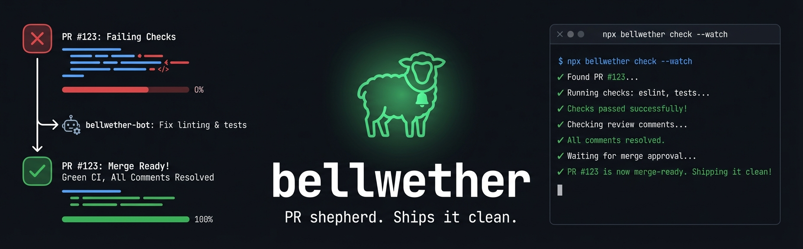

<div align="center">
  
</div>

<div align="center">

[](https://www.npmjs.com/package/bellwether)
[](https://www.npmjs.com/package/bellwether)
[](LICENSE)
[](https://nodejs.org)

</div>

---

**bellwether** watches your GitHub PR's CI, surfaces failures with actual error output, addresses review comments, and loops until `pr.ready = true`. One command. No babysitting.

## Why

Every developer knows the drill: push → wait for CI → check the status page → scroll through logs → fix → push → repeat. With AI coding agents in the picture it gets worse — every "wait and check" cycle is a context switch that breaks flow and burns tokens on polling.

bellwether closes that loop. It watches CI directly from your terminal (or your agent's context), returns the actual error output (not GitHub API noise), and keeps going until the PR is clean.

## Install

```bash
# Install globally (required — npx on-the-fly doesn't work from AI agents)
npm install -g bellwether

# Then add the Claude Code skill
bellwether skills add
```

## Hooks

Bellwether can install `PostToolUse` and `Stop` hooks into Claude Code (`~/.claude/settings.json`) and Codex (`~/.codex/hooks.json`). After a `git push` or `gh pr create/ready`, the hook tells the agent to resume the Bellwether loop immediately. When the agent tries to stop on a branch with an open PR, the stop hook runs `bellwether check` for that PR and blocks stopping unless the PR is actually merge-ready. Pending or in-progress CI is not treated as success.

```bash
# Install hooks into Claude Code and Codex
bellwether hooks add

# PostToolUse and Stop hook handler (called automatically by Claude Code / Codex)
bellwether hooks check --format json
```

`hooks add` is idempotent — re-running it replaces any existing bellwether hook entries with the latest configuration.

## Usage

```bash
# Watch CI + review comments + merge state
bellwether check --watch

# One-shot status check
bellwether check

# Show only unresolved review comments
bellwether check --unresolved

# Reply to a review comment and resolve it
bellwether check --reply "456:Fixed in abc1234" --resolve

# Full detail on a specific comment
bellwether check --detail 456

# Full help
bellwether check --help
```

## Output

Clean, structured, token-efficient:

```
pr:
  state: open
  mergeable: clean
  ready: true
ci:
  sha: abc1234
  checks: "3 total, 3 passing, 0 failing, 0 pending"
  passed: "build, lint, test"
reviews:
  total: "0 unresolved, 0 unanswered"
```

When CI fails, you get the actual error log — filtered, not raw GitHub metadata:

```
ci:
  FAIL build: "TypeError: Cannot find name 'fetch' at src/client.ts:12"
```

## How it works

bellwether is built around a watch loop:

```
check --watch
  → pr.ready = true?   → done ✓
  → pr.state terminal? → done ✓
  → CI failing?        → show filtered error logs → fix → push → repeat
  → Unresolved review? → show comment with context → address → reply → repeat
  → Merge conflict?    → sync branch → push → repeat
  → CI pending only?   → keep watching, do not stop, do not assume success
  → Still blocked?     → keep watching until ready/timeout → repeat
```

It queries GitHub's Check Runs API directly, filters job logs down to signal (compiler errors, test failures — not noise), and surfaces review threads with file and line context. `--watch` returns immediately if actionable work already exists; otherwise it establishes a baseline and waits for new actionable work, readiness, terminal PR state, or an inactivity timeout — no manual polling required. A pending or in-progress job is never a success condition; it means Bellwether should keep waiting until the first actionable signal appears or the PR becomes ready.

When a CI job fails, the agent workflow is: reproduce the failing command locally, fix the root cause, rerun that same failing command locally until it passes, then push and restart the watch. A timeout with green CI and zero unresolved reviews can still mean "waiting for review approval" or another external blocker; that case should not be turned into an infinite watch loop.

## Agent usage

bellwether ships as a Claude Code skill. Once installed, your agent gets a `SKILL.md` covering the full loop: watch CI → fix failures → address reviews → push → repeat until `pr.ready = true`.

```bash
bellwether skills add
```

The skill is also available on the [Claude Code marketplace](https://github.com/roderik/bellwether/blob/main/marketplace.json).

## Development

**Prerequisites:** [Bun](https://bun.sh) + Node.js >= 22

```bash
bun install
```

```bash
bun run dev              # dev mode — symlinks dist/ to src/
bun src/bin.ts check     # run directly from source
bun run build            # compile to dist/
bun check                # oxlint with type-aware rules
bun run test             # vitest
bun run test:coverage    # vitest with v8 coverage
bun run format           # oxfmt
```

**Publishing:** Push a version tag — GitHub Actions handles the rest (version bump, npm publish with provenance, commit back to main).

```bash
git tag v0.1.0 && git push --tags
```

## Project structure

```
src/
  bin.ts              # CLI entry point
  cli.ts              # incur CLI definition
  context.ts          # Bootstrap + PR resolution
  commands/
    check.ts          # check command (CI + reviews + merge state)
    ci.ts             # CI data helpers (flatten, getCISection)
    hook-add.ts       # hooks add — installs PostToolUse hooks
    hook-check.ts     # hooks check — PostToolUse hook handler
    reviews.ts        # Review helpers (list, detail, reply, watch)
  github/
    auth.ts           # GitHub token resolution
    fetch.ts          # Proxy-aware fetch + pagination
    repo.ts           # Git/repo helpers + merge state
    checks.ts         # Check Runs API + job log filtering
    comments.ts       # PR comments + review threads + GraphQL resolve
    index.ts          # Re-exports
skills/
  bellwether/
    SKILL.md          # Agent skill (shared across all install channels)
.claude-plugin/
  plugin.json         # Claude Code plugin manifest
```

## Credits

Built with [incur](https://github.com/wevm/incur). Inspired by [RTK](https://github.com/rtk-ai/rtk) (token-efficient CLI output filtering) and [agent-reviews](https://github.com/pbakaus/agent-reviews) (automated PR review resolution).

## License

[MIT](LICENSE)
